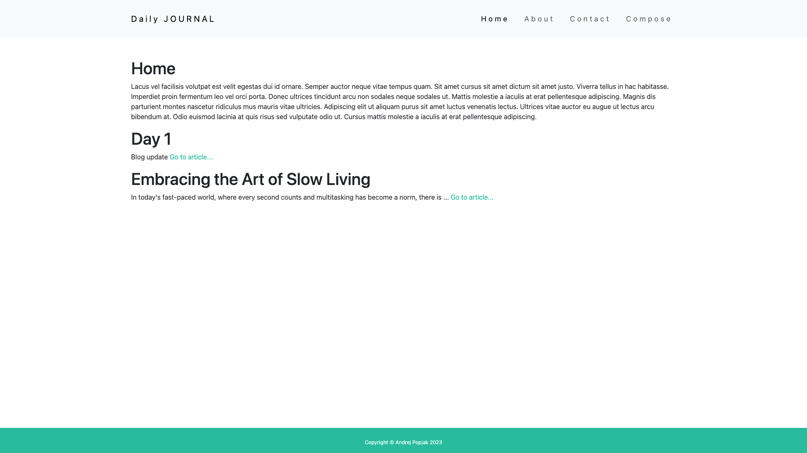
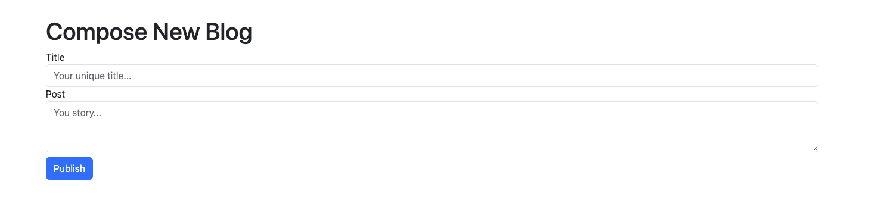
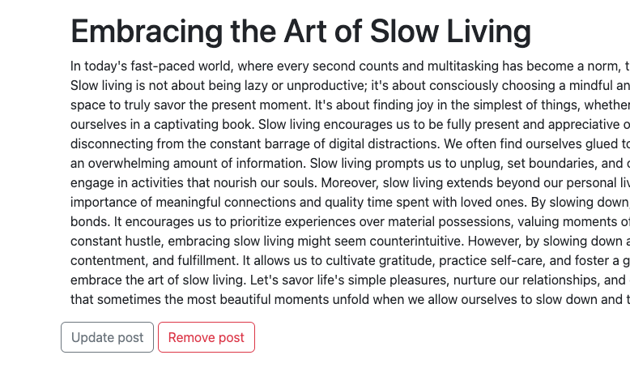

# Simple Personal Blog

Welcome to my personal website project! This single page which project was built solo. (CSS Styling is from external source). Frontend is made of HTML,CSS,THYMELEAF, Backend is Java 17 and SpringBoot.
Project us utilizing thymeleaf templating which ensure that code is very short. Whole project is connected to mongoDB which runs on docker. 

#








## Technologies Used

- HTML
- CSS
- Java
- Spring Boot 3
- MongoDB
- Thymeleaf
- Docker

## Features

- Personal Blog: The website includes a personal blog where I share my thoughts and experiences.
- Blog CRUD Operations: Users can read, remove, and update blogs.
- Create New Blogs: Users can create new blogs with a unique title.

## Getting Started

To get started with the project, follow the steps below:

1. Clone the repository to your local machine:

```
git clone https://github.com/your-username/personal-website.git
cd personal-website
```

2. Compose MongoDB using Docker Compose:

```
docker-compose up -d
```

Make sure you have Docker and Docker Compose installed on your machine. Then, run the following command:


This will set up a MongoDB container that the Spring Boot backend can connect to.

3. Build and Run the Project:

Make sure you have Java and Maven installed on your machine. Then, run the following commands:


This will build and start the Spring Boot backend, which connects to the MongoDB container.

4. Access the Website:

Once the project is up and running, you can access the website in your web browser by navigating to:

