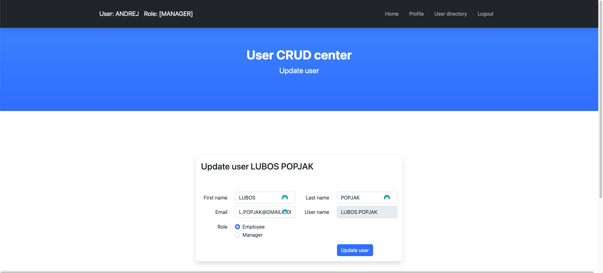

# Website-CRUD Project

_**pictures at the bottom_**
#### update: 1.7.2023 testing instance AWS at the moment down. Please clone the project and test it localy

#### update: 1.7.2023: implemented Thymeleaf templates, html code reduced by 300 lines. Templates located:

```properties
resources/templates/fragments
```


_## Access link:_
http://popjakwebappspringboot-env.eba-s3hgzvt3.eu-north-1.elasticbeanstalk.com/


## Technologies Used


- Backend:
    - Java
    - Spring Boot
    - PostgreSQL (running in a Docker container)

- Frontend:
    - Bootstrap


## Current Functionality

The project currently provides the following functionality:

### **update:19.6.2023**

* Changed login details deom username to Email. From now on, Users can use only email address to sign in.
* Code length has been significantly decreased
***

1. User Registration: Users can create a new account by registering their details.
2. User Login: Registered users can log in securely using their credentials.
3. Password Encryption BCRYPT: User passwords are securely encoded using bcrypt encryption.
4. Spring Security: The project is secured using Spring Security to protect the sensitive user information.
5. User Graphical Directory: Managers have access to a graphical directory where they can manage users. This feature is restricted to managers only.
6. Role-based Access: The website supports two roles, namely, Employee and Manager. Certain specific features are inaccessible to employees.
7. Profile Page: Users have a profile page where they can view and update their personal details.

## Future Plans

The following features and enhancements are planned for the future development of this website:

- email verification
- forget password button

##

Feel free to explore the current functionality of the project, and stay tuned for the upcoming enhancements!

## Note

Please note that this project is an independent endeavor and not based on any particular course or tutorial. It showcases the author's skills and expertise in developing a CRUD application using the specified technologies.

Feel free to explore the project and adapt it to your requirements!


## Getting Started

To get started with this project, if you want to test it on your own machine, please follow these steps:

### 1. Clone the Repository

Clone this repository to your local machine.


### 2. Create a PostgreSQL Database

Create a PostgreSQL database on your local machine or on a remote server. Make a note of the database name, username, and password.

### 3. Adjust Database Configuration

Open the `application.properties` file in the project root directory and update the following properties with your PostgreSQL database information:

```properties
spring.datasource.url=jdbc:postgresql://localhost:5432/your-database-name
spring.datasource.username=your-username
spring.datasource.password=your-password
```

### 4. Run the program

./mvnw spring-boot:run


## Beautiful Login screen


## Easy registration


## Simple Home screen


## Profile menu which includes everything you need


***
## only for Manager roles CRUD center



