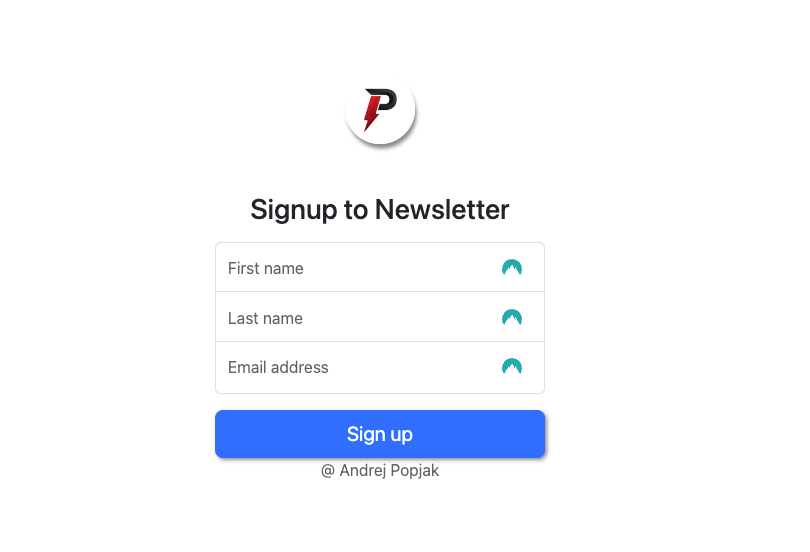

# Fullstack Signup Newsletter App

The Fullstack Signup Newsletter App is a web application that allows users to sign up for a newsletter. The application is built using Spring Boot, Thymeleaf, Java, Bootstrap, and the Mailchimp API.

## Technologies Used

- Spring Boot: A Java framework for building web applications.
- Thymeleaf: A server-side Java template engine for rendering HTML templates.
- Java: The programming language used for developing the application.
- Bootstrap: A popular CSS framework for creating responsive and mobile-first web pages.
- Mailchimp API: An API service provided by Mailchimp for managing mailing lists and sending newsletters.

## Functionality

The Fullstack Signup Newsletter App provides the following functionality:

- Users can sign up for the newsletter by entering their first name, last name, and email address.
- Upon submission, the user's information is sent to the Mailchimp API to add them to the mailing list.
- If the API request is successful, the user is shown a success message.
- If the API request fails, the user is shown an error message.

## Getting Started

To use the Fullstack Signup Newsletter App, follow these steps:

1. Clone the repository to your local machine.
2. Sign up for a Mailchimp account at [Mailchimp](https://mailchimp.com/) to receive your own list ID and API key.
3. Open the project directory and locate the file `ExternalApiService.java` in the `src/main/java/com/popjak/SignUP/externalApiService` directory.
4. Replace the placeholders `REPLACE-THIS-WITH-YOUR-LIST-ID` and `REPLACE-THIS-WITH-YOUR-OWN-KEY` with your actual Mailchimp list ID and API key.
5. Build and run the application using your preferred IDE or the command line.
6. Access the application in your web browser at `http://localhost:8080`.

## Contributing

Contributions to the Fullstack Signup Newsletter App are welcome! If you find any issues or have suggestions for improvements, feel free to open an issue or submit a pull request.

## License

This project is licensed under the [MIT License](LICENSE).
