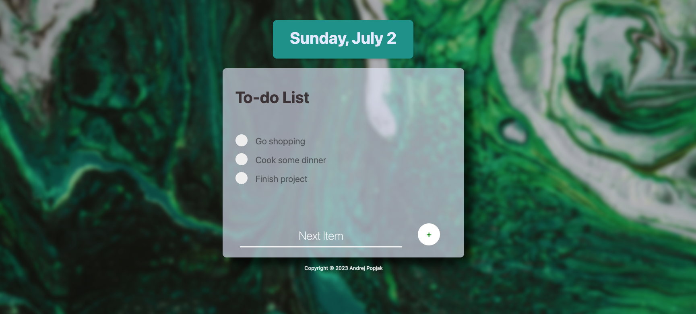
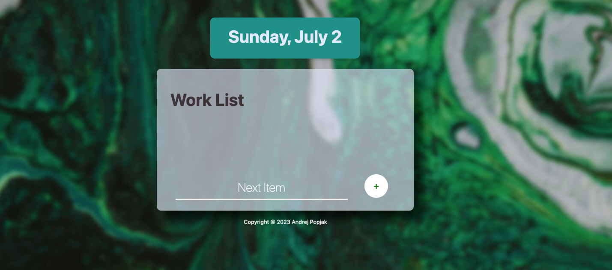
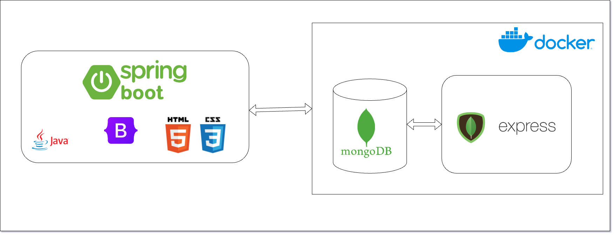

# Full Stack Todo List Application

The Full Stack Solo Project Todo List Application is a todo app that allows users to create and manage tasks. It provides a simple and intuitive interface for adding tasks, marking them as resolved, and organizing them into custom lists. The application leverages HTML, CSS, Spring Boot, Thymeleaf, and MongoDB to provide a full stack solution.





## Technologies Used

- HTML
- CSS
- Bootstrap
- Docker
- MongoDB
- Mongo Express
- Java 17
- Spring Boot
- Thymeleaf


## Features

- **Task Management:** Users can add tasks to their todo list and mark them as resolved by clicking on checkboxes.
- **Custom Lists:** The application supports custom lists, which can be created by using a custom HTML address. For example, accessing `localhost:8080/work` will create a "Work List" automatically in the database, along with all the necessary dependencies.
- **Data Persistence:** The tasks are automatically saved into a MongoDB database, ensuring that the data is persisted even after restarting the application.
- **Thymeleaf Templating:** The project utilizes the Thymeleaf templating system, which allows for dynamic HTML rendering and seamless integration with Spring Boot.
- **Containerization with Docker:** The application is containerized using Docker, enabling easy deployment and management of dependencies. The Docker Compose file located in the `resources/docker-compose` folder sets up the MongoDB database and Mongo Express for database management.

## Getting Started

To set up and run the Full Stack Todo List Application on your local machine, follow these steps:

1. **Clone the Repository:** Clone the repository to your local machine using the following command:

2. **Set Up the MongoDB Database:** Use Docker Compose to spin up the MongoDB database and Mongo Express by running the following command in your project's root directory:
```
docker-compose -f filelocation/docker-compose.yml up
```

   This command will start the MongoDB container and Mongo Express, providing a web-based interface to interact with the database. You can access Mongo Express at `http://localhost:8081`.

3. **Start the Application:** Run the application by executing the following command in your project's root directory:
   The application will be accessible at `http://localhost:8080`.

